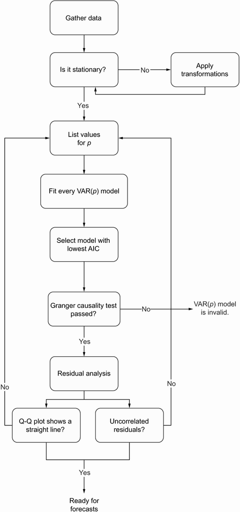

# Forecasting multiple time series

对于 SARIMAX 模型，这种关系是单向的：我们假设外生变量仅对目标有影响。

然而，两个时间序列有可能具有双向关系，这意味着时间序列 $t1$ 是时间序列 $t2$ 的预测器，时间序列 $t2$ 也是时间序列 $t1$ 的预测器。在这种情况下，拥有一个可以考虑这种双向关系并同时输出两个时间序列的预测的模型将会很有用。

这给我们带来了向量自回归（VAR）模型。这个特殊的模型使我们能够捕获多个时间序列之间随时间变化的关系。反过来，这使我们能够同时对许多时间序列进行预测，从而执行多元预测。

## Examining the VAR model

回想一下，AR(p) 将时间序列的值表示为常数 $C$、当前误差项 $\epsilon_t$（也是白噪声）以及序列过去值 $y_{t–p}$ 的的线性组合。

$$y_t = C + \phi_1y_{t–1}+ \phi_{2}y_{t–2} +\cdots+ \phi_{p}y_{t–p} + \epsilon_t$$

为简单起见，我们考虑一个具有两个时间序列（表示为 $y_{1,t}$ 和 $y_{2,t}$）且阶数为 1（即 $p = 1$）的系统。然后，使用矩阵表示法，VAR(1) 模型可以表示为：
$$
\begin{equation}
    \begin{bmatrix}
        y_{1,t} \\
        y_{2,t} \\
    \end{bmatrix}=
    \begin{bmatrix}
        C_1 \\
        C_2 \\
    \end{bmatrix}+
    \begin{bmatrix}
        \phi_{1,1} & {\phi_{1,2}} \\
        \phi_{2,1} & {\phi_{2,2}} \\
    \end{bmatrix}
    \begin{bmatrix}
        y_{1,t-1} \\
        y_{2,t-1} \\
    \end{bmatrix}+
    \begin{bmatrix}
        \epsilon_{1,t} \\
        \epsilon_{2,t} \\
    \end{bmatrix}
\end{equation}
$$
根据矩阵乘法：
$$
\begin{equation}\tag{2}
    \begin{aligned}
        y_{1,t} & =C_1+\phi_{1,1}y_{1,t-1}+\phi_{1,2}y_{2,t-1}+\epsilon_{1, t} \\
        y_{2,t} & =C_2+\phi_{2,1}y_{1,t-1}+\phi_{2,2}y_{2,t-1}+\epsilon_{2, t} \\
    \end{aligned}
\end{equation}
$$

在 $(2)$ 中，注意到 $y_{1,t}$ 的表达式包含 $y_{2,t}$ 的过去值。类似地，$y_{2,t}$ 的表达式包括 $y_{1,t}$ 的过去值。因此，可以看到 VAR 模型如何捕捉每个序列对另一个序列的影响。

就像 AR(p) 模型一样，VAR(p) 模型要求每个时间序列都是平稳的。仅当两个序列均可用于相互预测时，VAR(p) 模型才有效。简单的看图形不足以支持该假设，必须应用格兰杰因果关系检验，这是一种统计假设检验，用于确定一个时间序列是否可以预测另一个时间序列。只有这个检验成功了，我们才能应用 VAR 模型进行预测。这是使用 VAR 模型时建模过程中的重要一步。

## 确认 VAR(p) 模型的建模过程

VAR(p) 模型的完整建模流程如图所示：

它与 ARMA(p,q) 模型一直使用的建模过程非常相似，但这次我们拟合不同的 VAR(p) 模型并选择 AIC 最低的模型。然后我们进行格兰杰因果关系检验。如果失败，则 VAR(p) 模型无效，我们将不再继续该程序。另一方面，如果检验通过，我们将进行残差分析。如果残差类似于白噪声，则可以使用 VAR(p) 模型进行预测。

如果格兰杰因果关系检验失败，就不能说一个时间序列的过去值可以预测另一个时间序列。在这种情况下，VAR(p) 模型变得无效，我们必须恢复使用 SARIMAX 模型的变体来预测时间序列。另一方面，如果格兰杰因果检验通过，我们可以通过残差分析恢复程序。和之前一样，如果残差接近白噪声，我们可以使用所选的 VAR(p) 模型进行预测。

### Exploring the Granger causality test

请注意，格兰杰因果关系检验仅限于预测因果关系，因为我们只是确定一个时间序列的过去值在预测另一个时间序列时是否具有统计显着性。此外，格兰杰因果关系检验仅检验一个方向的因果关系；我们必须重复检验来验证 $y_{1,t}$ 是否也是 $y_{2,t}$ 的格兰杰原因，以保证 VAR 模型有效。否则，我们必须使用 SARIMAX 模型并分别预测每个时间序列。

此检验的零假设表明 $y_{2,t} 不会产生格兰杰原因 $y_{1,t}$。同样，我们将使用临界值为 0.05 的 p 值来确定是否拒绝原假设。在格兰杰因果检验返回的 p 值小于 0.05 的情况下，我们可以拒绝零假设并说 $y_{2,t} 格兰杰原因 $y_{1,t}$。

可以看到，选择 VAR(p) 模型后才会执行 Granger 因果关系检验。这是因为检验要求我们指定检验中要包含的滞后数，这相当于模型的阶数。例如，如果所选 VAR(p) 模型的阶数为 3，则格兰杰因果关系检验将确定时间序列的过去三个值在预测其他时间序列时是否具有统计显着性。

## Forecasting real disposable income and real consumption
